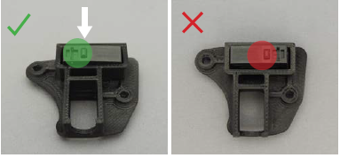
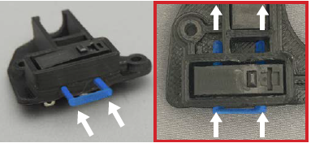
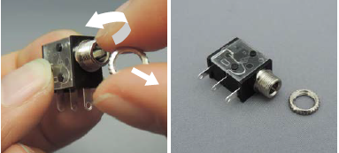
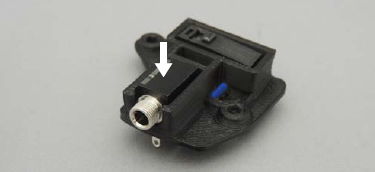
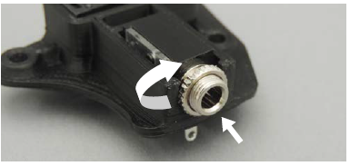
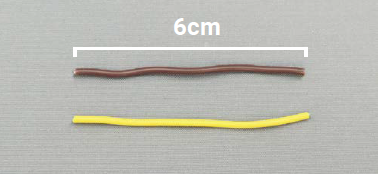
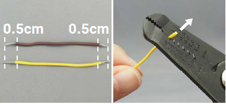
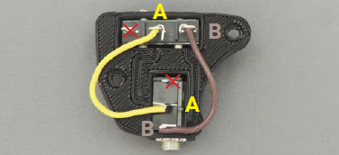
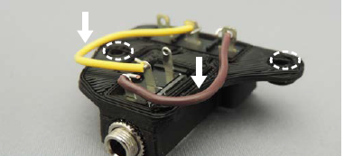

[M4x10 screws]:Parts.yaml#M4x10PanSteel
[No. 2 Phillips screwdriver]:Parts.yaml#Screwdriver_Philips_No2
[limit switch]:Parts.yaml#Limit_Switch
[MMC60 Switch Mount]:Parts.yaml#Switch_Mount
[MMC60 Button Pins]:Parts.yaml#MMC60_Button_Pin
[mono jack]:Parts.yaml#Mono_Jack
[22 AWG wire]:Parts.yaml#22_AWG_Wire
[wire strippers]:Parts.yaml#Wire_Strippers

# Assemble Electronics

## Position limit switch {pagestep}

Insert the [limit switch]{Qty: 1, Cat: part} into the [MMC60 Switch Mount]{Qty:1 , Cat: part} as shown.

## Insert pins {pagestep}

Insert the [MMC60 Button Pins]{Qty:1, Cat: part} through the switch mount and limit switch, as shown.

## Remove nut from jack {pagestep}

If the nut is attached to the [mono jack]{Qty: 1, Cat: part}, remove it. Place the nut somewhere you will not lose track of it or where it cannot roll away.

## Position jack {pagestep}

Place the mono jack in the switch mount, as shown.

## Secure jack {pagestep}

Tighten the nut onto the mono jack to secure it to the switch mount. You may need to use pliers to tighten it sufficiently.

## Cut and strip wires {pagestep}

* Use the [wire strippers]{Qty: 1, Cat: tool}  to cut two, 6 cm lengths of [22 AWG wire]{Qty: 12 cm, Cat: part}.

* Use the wire strippers to strip 0.5 cm off both ends of each wire.

## Connect wires {pagestep}

* Connect the **A terminals** together with one wire and bend in place. Connect the **B terminals**  with the second wire and bend in place.

* Flatten the wires so they're flush against the switch mount. Do not obstruct the two holes.

