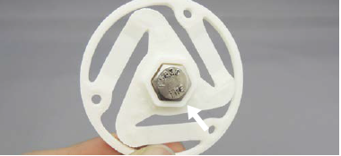
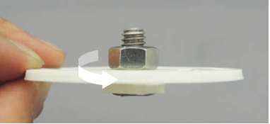
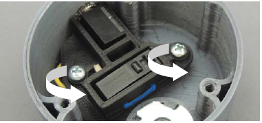
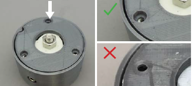
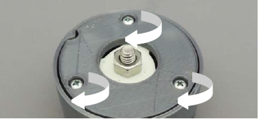
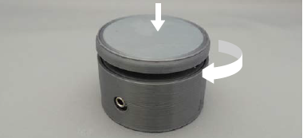

[MMC60 Button Flexure]:Parts.yaml#MMC60_Button_Flexure
[MMC60 Button Base Bottom]:Parts.yaml#MMC60_Button_Base_Bottom
[MMC60 Button Base Top]:Parts.yaml#MMC60_Button_Base_Top
[MMC60 Button Cap]:Parts.yaml#MMC60_Button_Cap
[hex bolt]:Parts.yaml#Hex_Bolt
[hex nut]:Parts.yaml#Hex_Nut
[M4 screws]:Parts.yaml#M4x3/8Pan_Steel
[No.2 Phillips screwdriver]:Parts.yaml#Screwdriver_Philips_No2

# Assemble Switch

## Assemble flexure {pagestep}

Place the [hex bolt] through the bottom of the [MMC60 Button Flexure]{Qty: 1, Cat: part}. Tighten a [hex nut]{Qty: 1, Cat: part}
onto the bolt to secure it in place.

## Mount the switch and jack {pagestep}

Place the switch mount with the mono jack and limit switch in the [MMC60 Button Base Bottom]. Use two [M4 screws]{Qty: 2, Cat: part}
to secure them in place.

## Insert flexure {pagestep}

Insert the flexure into the base. Use the keyed notch to guide insertion.

## Connect the base top {pagestep}

Insert the [MMC60 Button Base Top]{Qty: 1, Cat: part} into the base bottom with the screw hole divots up. Use three [M4 screws]{Qty: 3, Cat: part}
to secure it in place.

## Add button cap {pagestep}

Screw the [MMC60 Button Cap] onto the exposed threads of the hex bolt. 

Congratulations, your switch is now complete!

