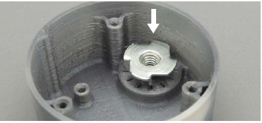

[M4x10 screws]:Parts.yaml#M4x10PanSteel
[No. 2 Phillips screwdriver]:Parts.yaml#Screwdriver_Philips_No2
[tee-nut]:Parts.yaml#Tee_Nut
[hex nut]:Parts.yaml#Hex_Nut
[MMC60 Button Cap]:Parts.yaml#MMC60_Button_Cap
[base bottom]:Parts.yaml#MMC60_Base_Bottom
[pliers]:Parts.yaml#Needle_Nose_Pliers

# Insert Nuts

## Insert hex nut {pagestep}

Insert a [hex nut]{Qty: 1, Cat: part} into the space on the [MMC60 Button Cap].

## Position the Tee-Nut {pagestep}

Place the [tee-nut] teeth onto the slits in the [base bottom], as shown.

## Seat the Tee-Nut {pagestep}

* Screw the hex bolt from the bottom of the base through the tee-nut. 
* Use the [pliers] to tighten the hex bolt until the tee-nut sits flush with the 3D printed part.
* Remove the hex bolt.

 

