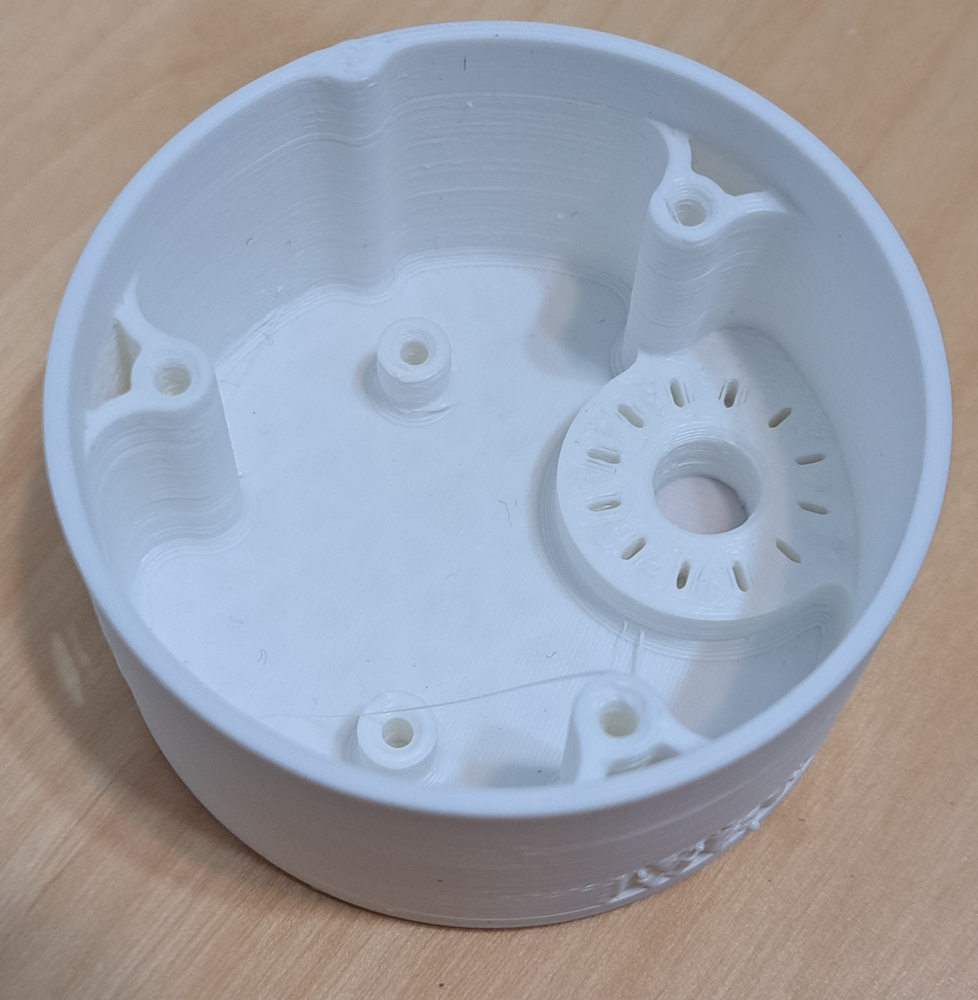
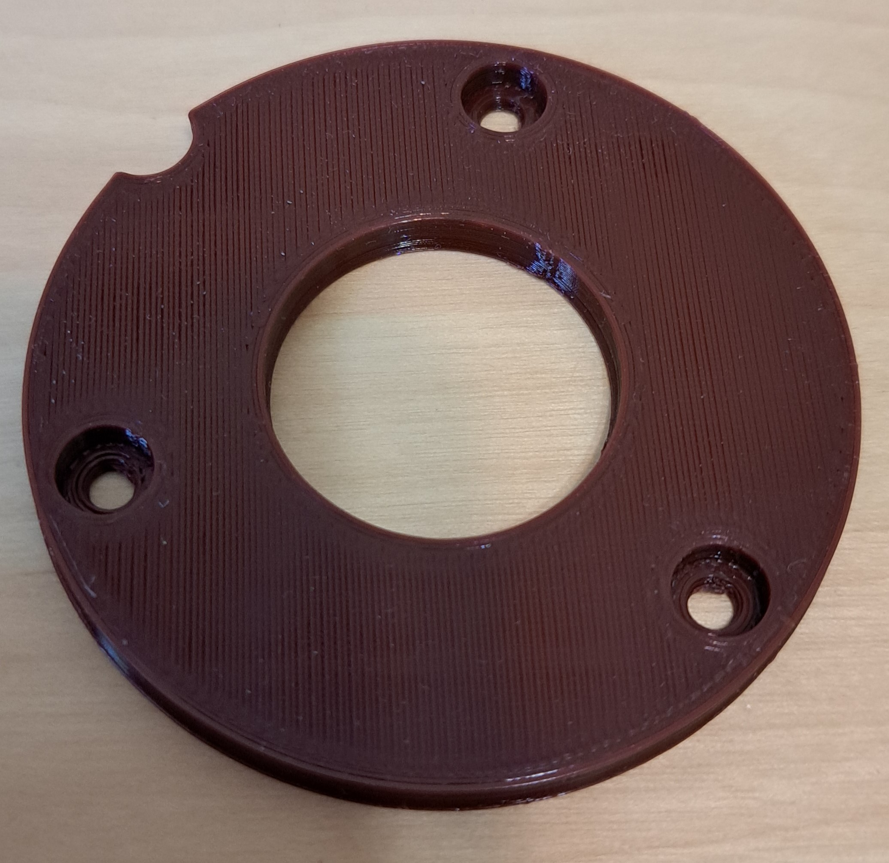
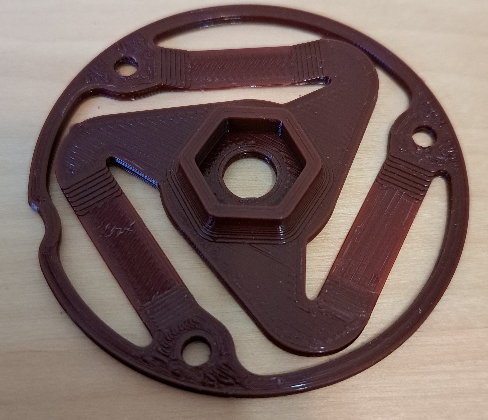
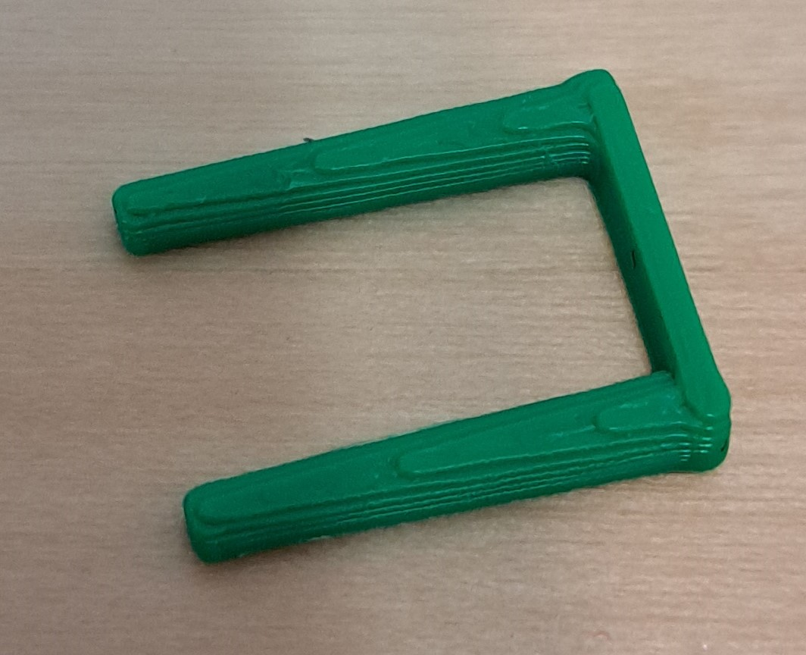
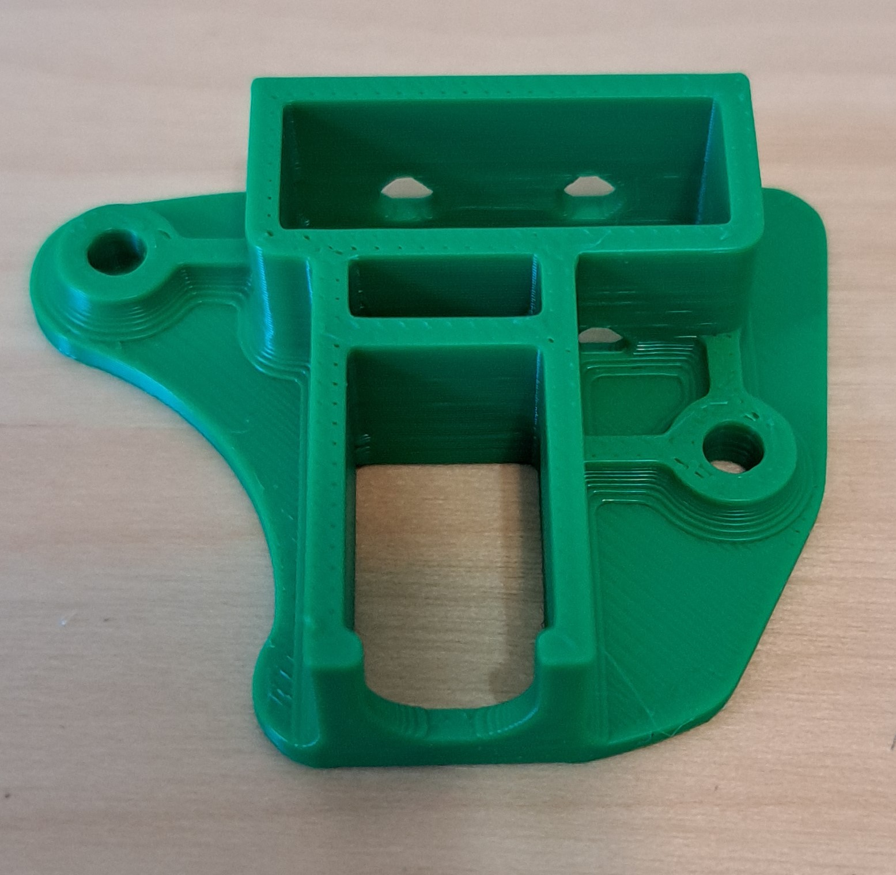
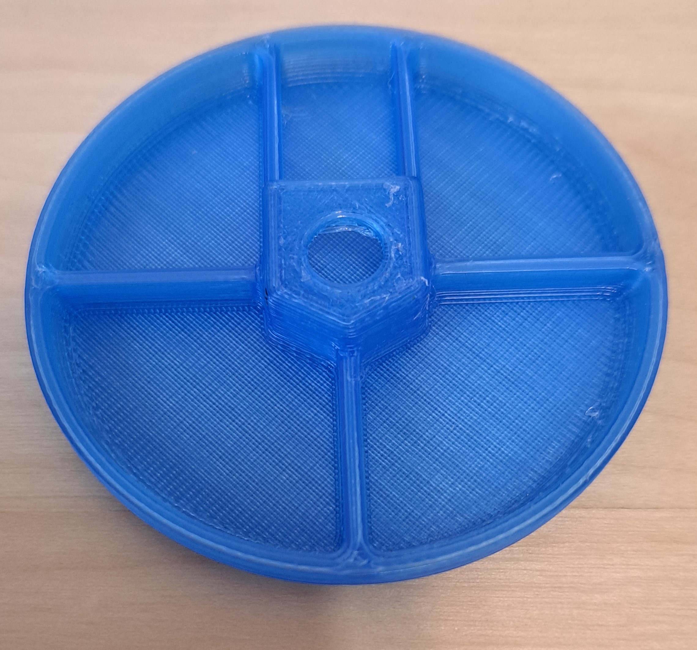

[M4x10 screws]:Parts.yaml#M4x10PanSteel
[No. 2 Phillips screwdriver]:Parts.yaml#Screwdriver_Philips_No2
[MMC60 Button Base Bottom]:Parts.yaml#MMC60_Base_Bottom
[MMC60 Button Base Top]:Parts.yaml#MMC60_Base_Top
[MMC60 Button Cap]:Parts.yaml#MMC60_Button_Cap
[MMC60 Button Flexure]:Parts.yaml#MMC60_Button_Flexure
[MMC60 Button Pins]:Parts.yaml#MMC60_Button_Pin
[MMC60 Switch Mount]:Parts.yaml#MMC60_Switch_Mount

# 3D Printing Parts

## 3D print the following parts. {pagestep}

All .stl files for 3D printing this switch are available at the [Printables MMC60 Switch device page](https://www.printables.com/model/214286-mmc60-switch).

>i All parts are designed to be printed with a 0.2 mm layer height, 20% infill, no supports, and a 0.4 mm nozzle diameter unless otherwise stated.

|Part Picture | Part Name | Part Number|
|---|---|---|
|| [MMC60 Base Bottom][MMC60 Button Base Bottom]{Qty: 0, Cat: part} | 1A|
|| [MMC60 Button Base Top][MMC60 Button Base Top]{Qty: 0, Cat: part} | 1B|
|| [MMC60 Button Flexure][MMC60 Button Flexure]{Qty: 0, Cat: part} | 1C|
|| [MMC60 Button Pin][MMC60 Button Pins]{Qty: 0, Cat: part} | 1D|
|| [MMC60 Switch Mount][MMC60 Switch Mount]{Qty: 0, Cat: part} | 1E|
|| [MMC60 Button Cap][MMC60 Button Cap]{Qty: 0, Cat: part} | 1F|

