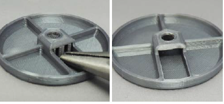
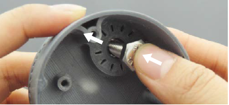
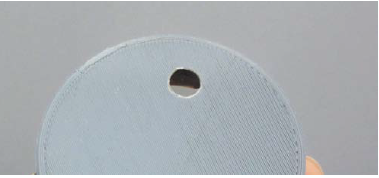

[M4x10 screws]:Parts.yaml#M4x10PanSteel
[No. 2 Phillips screwdriver]:Parts.yaml#Screwdriver_Philips_No2
[MMC60 Button Cap]:Parts.yaml#MMC60_Button_Cap
[MMC60 Button Base Bottom]:Parts.yaml#MMC60_Base_Bottom
[needle nose pliers]:Parts.yaml#Needle_Nose_Pliers
[hex bolt]:Parts.yaml#Hex_Bolt

# Remove sacrificial plastic

## Remove sacrificial plastic from button cap. {pagestep}

* Remove the sacrificial layer of plastic from the [MMC60 Button Cap]{Qty: 1, Cat: part} using a pair of [needle nose pliers]{Qty:1, Cat: tool}.

## Clear hole in base. {pagestep}

Push the [hex bolt]{Qty: 1, Cat: part} through the [MMC60 Button Base Bottom]{Qty: 1, Cat: part}, as shown in the first image. Make sure the layer of sacrificial plastic is fully removed and the hole is clear, as shown in the second image.

