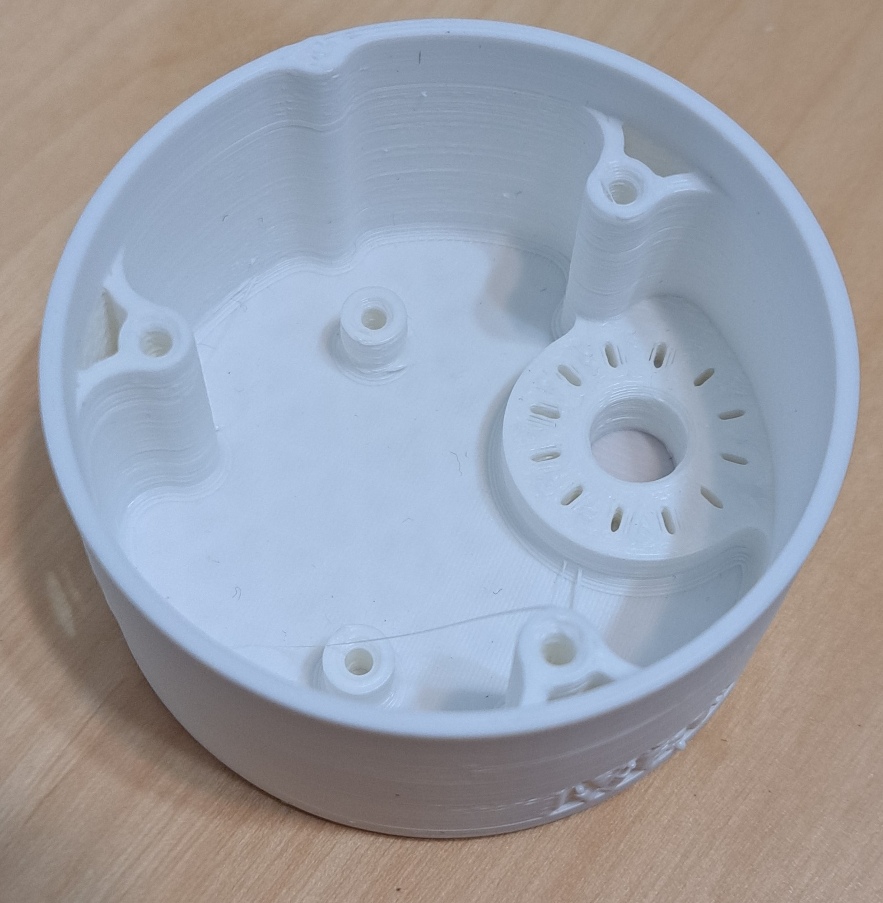
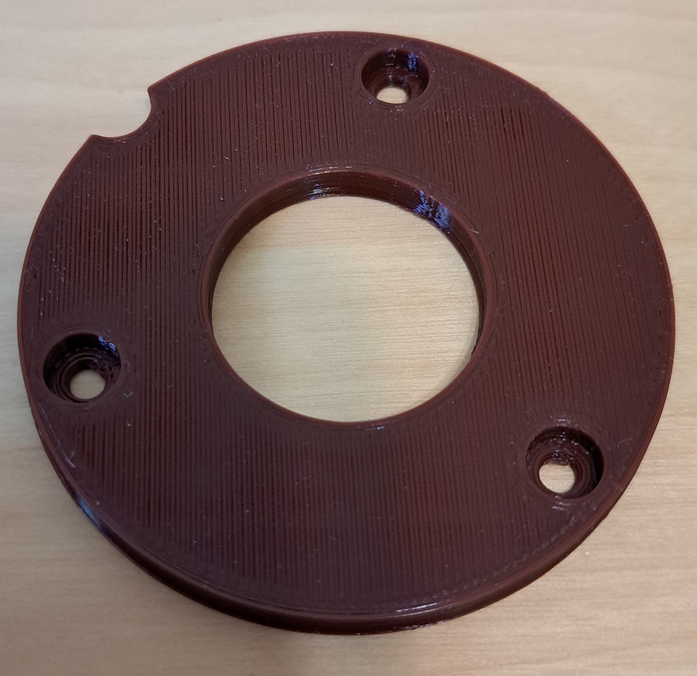

# MMC60 Assembly Guide

## Required Parts and Tools

{{BOM}}

You can access the full [bill of materials here]{BOM}.
## Parts and Tools Images

All required parts and tools for this build are shown in the below image gallery.

##Step Summary

* [.](Print-Parts.md){step}
* [.](Remove_Plastic.md){step}
* [.](Insert_Tee_Nut.md){step}
* [.](Assemble_Electronics.md){step}
* [.](Solder_Electronics.md){step}
* [.](Assemble_Switch.md){step}

